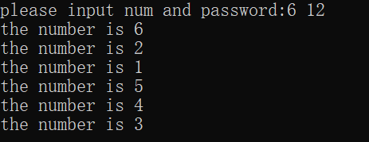
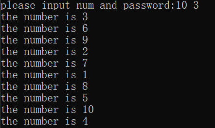
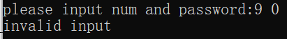
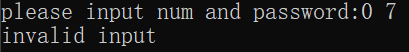

# 实验名称： 约瑟夫环
## 一、问题描述
设有编号为 1,2,…,n 的 n（n＞0）个人围成一个圈，每个人持有一个密码 m。 从第一个人开始报数，报到 m 时停止报数，报 m 的人出圈，再从他的下一个人 起重新报数，报到 m 时停止报数，报 m 的出圈，……，如此下去，直到所有人 全部出圈为止。当任意给定 n 和 m 后，设计算法求 n 个人出圈的次序


## 二、数据结构设计
```c++
typedef struct node {
  int num;          //数据域
  struct node* nxt;  //指针域
}node, * Linklist;
```


## 三、算法设计
```c++
1.首先定义线性表的链表存储结构体：
typedef struct node {
	int num;          //数据域
	struct node* nxt;  //指针域
}node, * Linklist;
```

2.构建循环链表，在构建单链表的同时，对每个结点进行赋值，代表每位同学，数值为其序号，并同时将结构体修改为单向循环链表，最后返回一个指向头节点的指针：
```c++
Linklist Create(int n) {
	Linklist L = (Linklist)malloc(sizeof(node));
	if (!L)exit(1);//若创建失败则返回
	L->nxt = L;    //自身循环
	L->num = 0;
	Linklist p, q = L;
	p = L;
	int i;
	// 尾插法 
	for (i = 1; i <= n; i++) {
		p = (Linklist)malloc(sizeof(node));
		p->num = i;
		q->nxt = p;
		q = p;
	}
	q->nxt = L;//循环链表，方便环形查找 
	return L;//返回头结点 
}
```

3.开始出圈，用一个指针找到应出圈的人的前一个，再用一个指针辅助出圈，每次出圈后应将指针放到刚出圈的下一个，直到所有元素都出圈为止。需要注意若遇到头节点应特判：
```c++
void Delete(int n, int m, Linklist& L) {
	int i;
	Linklist p = L->nxt;
	while (1) {
		//找到应该出圈的前一个人 
		for (i = 1; i < m - 1; i++) {
			p = p->nxt;
			//若循环到头结点应跳过 
			if (p == L) {
				p = p->nxt;
			}
		}
		Linklist q;
		if (p->nxt == L)p = p->nxt;//下一个为头结点，则P指向头结点 
		if (p->nxt == L)return;//此时只有一个头结点，结束循环 
		printf("the number is %d\n", p->nxt->num);
		q = p->nxt;
		p->nxt = q->nxt;
		p = q->nxt;//从删除的下一个节点出发	
		if (p == L)p = p->nxt;//到头结点就跳过 
		free(q);
	}
}
```

## 四、界面设计
在主函数中完成界面设计，使用printf函数来打印出最基本的需求和结果
```c++
int main() {
	printf("please input num and password:");
	int n, m;
	scanf_s("%d%d", &n, &m);
	if (m <= 0 || n <= 0) {
		printf("invalid input\n");
		return 0;
	}
	Linklist L1 = Create(n);
	int i;
	for (i = 1; i <= n; i++)Delete(n, m, L1);
	return 0;
}
```


## 五、运行测试与分析
1. 令人数为6人，密码为12 即输入 n = 6, m = 12后，界面显示如下：



2. 令人数为10人，密码为3 即输入 n = 10, m =3后，界面显示如下：



3. 令人数为9人，密码为0 即输入 n = 9, m =0后，界面显示如下：



4.令人数为0人，密码为7 即输入 n = 0, m = 7后，界面显示如下：



## 六、实验收获与思考
<1>思考问题：
1.采用顺序存储结构如何实现约瑟夫环问题？
①创建顺序表，顺序表应能存储长度
②给顺序表赋值
③从第一个元素开始计数，每 m 个输出对应元素值，遇到表尾时回到首端
④该元素后方所有元素覆盖前一位元素，顺序表长度减1
⑤从当前元素位置重新计数
⑥顺序表长度为1时结束
2.如果每个人持有的密码不同，应如何实现约瑟夫环问题？
①定义带有两个数据域的链表存储结构体：
```c++
typedef struct LNode{
int password;  //数据
    int position;   //数据
    struct LNode *next;  //指针
}
```
②创建带有两个数据域的链表
③链表赋值，进行n次循环，对结点赋值密码与位置
④首尾链接，构成循环链表
⑤从初始结点开始循环计数
⑥当计数器数值与结点password值相等时，输出结点元素position值
⑦删除结点, 从当前结点重新循环计数，进行循环
⑧当循环链表中只剩下唯一结点，结束

<2>实验收获：
通过这次实验，首先我对线性表有了更加深刻的理解，在编写代码的过程中进一步熟悉了链表的实现、操作和使用，对链表中节点的插入和删除等操作更加了解。除此之外，在这个过程中，我对于上学期C语言和C++的相关知识有了更好的掌握，能够熟练运用C/C++语言实现一些功能，解决生活中的问题。
