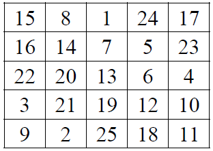
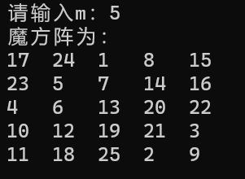
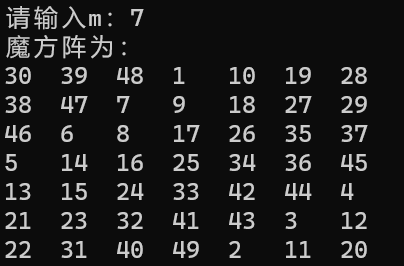
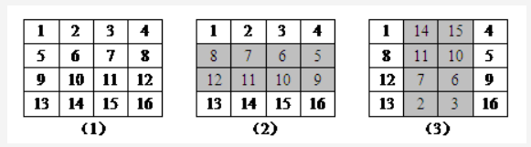

## 实验名称：魔方阵
# 一、问题描述
魔方阵是一个古老的智力问题，它要求在一个m×m的矩阵中填入1～m^2的数字（m 为奇数），使得每一行、每一列、每条对角线的累加和都相等，如图 1 所示。



图1 —— 五阶魔方阵示例

## 二、数据结构设计
使用二位数组进行存储：
```c++
#define MAXN 100
int a[MAXN][MAXN] = { 0 };
```

## 三、算法设计
·首先将1写在第一行的中间
·之后，按如下方式从小到大依次填写每个数K(K=2,3,...,N*N)
·若(K-1)在第一行但不在最后一列，则将K填在最后一行，(K-1)所在列的右一列
·若 (K-1)在最后一列但不在第一行，则将K填在第一列，(K-1)所在行的上一行
·若 (K-1)在第一行最后一列，则将K填在(K-1)的正下方
·若 (K-1)既不在第一行，也不在最后一列：
如果(K-1)的右上方还未填数，则将K填在 (K-1)的右上方；
否则将K填在(K-1)的正下方

```c++
void BuildSqaure(int m) {//每次将数放在上一个数的右上角（以左上角为最小），遇到边界则取余，遇到已赋值的则放在上一个数的下方
	printf("魔方阵为：\n");
	a[0][m / 2] = 1;//1在第一行中间
	int row = 0, col = m / 2;//把行和列初始化为1所在位置
	for (int i = 2; i <= m * m; i++) {
		row = (row + m - 1) % m;//row上移
		col = (col + 1) % m;//col右移
		if (a[row][col]) {
			row = (row + 2) % m;//row下移
			col = (col + m - 1) % m;//col左移
		}
		a[row][col] = i;
	}
	for (int i = 0; i < m; i++) {
		for (int j = 0; j < m; j++)
			printf("%-4d", a[i][j]);
		printf("\n");
	}
}
```

## 四、界面设计
采用简单的printf函数，若遇到数据不合法情况会提示。
```c++
int main() {
	int m;
	printf("请输入m：");
	scanf("%d", &m);
	if (m % 2 == 1) {
		BuildSqaure(m);
		//BuildSqaure2(m);
	}
	else {
		printf("输入不合法！");
	}
	return 0;
}
```
例如当输入阶数为5时：



图4-1 —— 界面设计
当m输入不为奇数时(输入不合法)：


图4-2 —— 界面设计


## 五、运行测试与分析
当输入阶数为5时：


图5-1 —— 数据测试
当输入阶数为7时：



图5-2 —— 数据测试
当输入阶数为4时(输入不合法)：


图5-3 —— 数据测试

## 六、实验收获与思考
1.思考问题
①loubere法生成奇阶幻方
在居中的方格向上一格内放1，依次向右上方填入2、3、4…，如果右上方已有数字，则向上移两格继续填写。如下图用Louberel法生成的5阶幻方：
23 6 19 2 15
10 18 1 14 22
17 5 13 21 9
4 12 25 8 16
11 24 7 20 3
代码：
```c++
void BuildSqaure2(int m) {//每次将数放在上一个数的右上角（以左上角为最小），遇到边界则取余，遇到已赋值的则往上两个
	printf("魔方阵为：\n");
	a[m / 2 - 1][m / 2] = 1;
	int row = m / 2 - 1, col = m / 2;
	for (int i = 2; i <= m * m; i++) {
		row = (row + m - 1) % m;
		col = (col + 1) % m;
		if (a[row][col]) {
			row = (row - 1 + m) % m;
			col = (col + m - 1) % m;
		}
		a[row][col] = i;
	}
	for (int i = 0; i < m; i++) {
		for (int j = 0; j < m; j++)
			printf("%-4d", a[i][j]);
		printf("\n");
	}
}
```
上述loubere法可以记作X+Y斜步（数字按右上方顺序填入），2Y跳步（如果右上方已有数字或出了对角线，则向上移二格继续填写）。对于X+Y斜步相应的跳步可以为2X，2Y。
·2Y跳步，则在居中的方格向上一格放1里，按上斜步，2Y跳步的方法构成幻方。
·-2Y跳步，则在居中的方格向下一格放1里，按下斜步，-2Y跳步的方法构成幻方。
·2X跳步，则在居中的方格向右一格放1里，按右斜步，2X跳步的方法构成幻方。
·-2X跳步，则在居中的方格向左一格放1里，按左斜步，-2X跳步的方法构成幻方。
②双偶数阶幻方的实现
当n为双偶数，即n=4*k时，采用双向翻转法。双向翻转法构造魔方阵的步骤如下：
·将数字1到n*n按由左至右、由上到下的顺序填入方阵中。
·将方阵中央部分半数的行中的所有数字左右翻转。
·将方阵中央部分半数的列中的所有数字上下翻转。
由于在构造的过程中需要进行两次翻转，因此称为双向翻转法。下面以构造一个4阶魔方阵为例，说明这种方法的构造过程，具体如下图所示。



2.实验收获
本次课程设计我选择了魔方阵问题，在刚开始读到问题的时候，仅仅是对魔方阵的基本性质有了基本的了解，但是对他的实现感到十分茫然，但是通过查阅资料并加以思考，掌握了解决魔方阵问题的方法——斜行法。在自己实现算法时也在幻方的边界处遇到了一定问题，但最终还是在重构代码后解决了。完成了这次实验，我也充分了解到自身代码能力的不足以及查阅资料学习的重要性。

