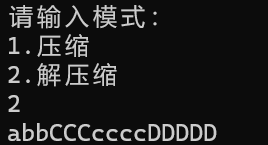

# 实验名称：文件压缩
## 一、问题描述
哈夫曼编码是一种常用的数据压缩技术，对数据文件进行哈夫曼编码可大大
缩短文件的传输长度，提高信道利用率及传输效率。要求采用哈夫曼编码原理，
统计文本文件中字符出现的词频，以词频作为权值，对文件进行哈夫曼编码以达
到压缩文件的目的，再用哈夫曼编码进行译码解压缩。

## 二、数据结构设计
在本实验中，我采用结构体来存储哈夫曼树，用数组存储哈夫曼编码
```c++
typedef struct node {
	int weight;
	char c;
	int p, l, r;
	node(int n, int m, char ch) {
		weight = n;
		p = l = r = m, c = ch;
	}
}HTnode, *HufTree;
typedef char** HufCode;//哈夫曼编码字符串数组
```

## 三、算法设计
本实验中，我首先写了文件打开及读取算法，其算法如下：
```c++
void Count() {//打开文件并计算其中字符出现的频率
	FILE* file;
	file = fopen("1.txt", "r+");
	if (file == NULL) {
		printf("文件打开错误！\n");
		exit(0);
	}

	fscanf(file, "%s", s);
	int i = 0;
	while (s[i] != '\0') {
		if (!cnt[s[i]])
			++n;  //n为字符种类的总数
		cnt[s[i]]++;  //对应的cnt数组的ASCII值位加一 ，统计每种字符的数量
		i++;
	}
	m = 2 * n;//总共需要两倍叶子节点个数的节点
	fclose(file);
}
```

之后我完成了找到最小字符的函数，其算法如下：
```c++
int select(int n) {//找到权值最小的字符
	int minn = 0x3f3f3f3f, minnode = 0;//近似为无穷大使用
	for (int i = 1; i <= n; i++) {
		if (!HT[i].p && HT[i].weight < minn) {//如果没有父节点则进行对比
			minn = HT[i].weight;
			minnode = i;
		}
	}
	return minnode;
}
```

接着，便是建立哈夫曼树了，其算法如下：
```c++
void CreateHT() {//建哈夫曼树
	HT = (HufTree)malloc(m * sizeof(HTnode));//节点数组
	for (int i = 1, j = 0; i <= n; i++) {//给每个节点赋值
		while (!cnt[j])j++;
		HT[i] = HTnode(cnt[j], 0, (char)j);//若cnt[j]不为0，则其为一个出现过的字符，为其初始化一个节点
		j++;
	}
	for (int i = n + 1; i < m; i++)
		HT[i] = HTnode(0, 0, '#');//构造哈夫曼树的其他节点
	for (int i = n + 1; i < m; i++) {//合并叶子节点
		int s1 = select(i - 1);
		HT[s1].p = i, HT[i].l = s1;
		int s2 = select(i - 1);
		HT[s2].p = i, HT[i].r = s2;
		HT[i].weight = HT[s1].weight + HT[s2].weight;
	}
}
```

在建立哈夫曼树后，我们就要完成哈夫曼编码，其函数如下：
```c++
void CreateHTCode() {//构造哈夫曼编码
	char* cd = (char*)malloc(n * sizeof(char));
	FILE* file = fopen("HufCode", "w+");
	if (file == NULL) {
		printf("文件打开错误！\n");
		exit(0);
	}
	string ss = "";//存储一个临时的哈夫曼编码
	for (int i = 1; i <= n; i++) {
		int start = n - 1;//从后往前构建
		for (int c = i, f = HT[c].p; f != 0; c = f, f = HT[c].p) {
			if (HT[f].l == c)//左孩子
				cd[start--] = '0';
			else//右孩子
				cd[start--] = '1';
		}
		for (int j = start + 1; j < n; j++) {
			ss += cd[j];
		}
		HC[(int)HT[i].c] = ss;
		fprintf(file, "%c %s\n", (char)HT[i].c, ss.c_str());//将这个字符的哈夫曼编码写入文件
		ss = "";
	}
	fclose(file);
}
```

在完成了上述函数的编写之后，开始进行文件的压缩与解压算法的编写了，其程序如下：
```c++
void Compress() {//压缩
	FILE* file = fopen("compressed file", "w+");
	if (file == NULL) {
		printf("文件打开错误！\n");
		exit(0);
	}

	string lltt = "";//要写入文件的字符串
	int i = 0;
	while (s[i] != '\0') {
		lltt += HC[(int)s[i++]];
	}
	fprintf(file, "%s", lltt.c_str());
	printf("压缩完成！");
	fclose(file);
}

void unCompress() {//解压
	FILE* file = fopen("compressed file", "r+");
	if (file == NULL) {
		printf("文件打开错误！\n");
		exit(0);
	}

	string ll = "";//用于存储哈夫曼编码的临时字符串
	char llc[MAXN];//将文件中总的哈夫曼编码写入这个字符串数组
	fscanf(file, "%s", llc);
	int i = 0;
	while (llc[i] != '\0') {
		ll += llc[i];
		i++;
		for (int j = 1; j <= 128; j++) {//每加一个字符就与目前已经有的哈夫曼编码进行对比
			if (ll == HC[j]) {//如果相同则清空临时字符串，将对应的字符打印出来
				printf("%c", j);
				ll = "";
				break;
			}
		}
	}
	fclose(file);
}
```

## 四、界面设计
本程序中包含有压缩与解压两个部分，所以采用菜单方便用户选择功能。
```c++
int main() {
	Count();
	CreateHT();
	CreateHTCode();
	printf("请输入模式：\n");
	printf("1.压缩\n");
	printf("2.解压缩\n");
	int n;
	scanf("%d", &n);
	switch (n) {
	case 1:Compress(); break;
	case 2:unCompress(); break;
	default:printf("输入错误！"); break;
	}
	return 0;
}
```
菜单如下图所示：


图1 —— 界面设计

## 五、运行测试与分析
1.运行程序，根据提示，选择压缩文件，如下图所示：


图2

2. 选择文件解压，如下图所示：



图3

3.无效输入示例：


图4

4.查看输入的文本：


图5

5.查看生成的哈夫曼编码：


图6

6.查看利用哈夫曼编码对原文字的压缩：


图7

## 六、实验收获与思考
这次实验通过哈夫曼树实现文件的压缩和解压缩，使我对树的认识和哈夫曼编码的理解更深了，同时还复习了之前不太熟练的文件操作，使我受益匪浅。


